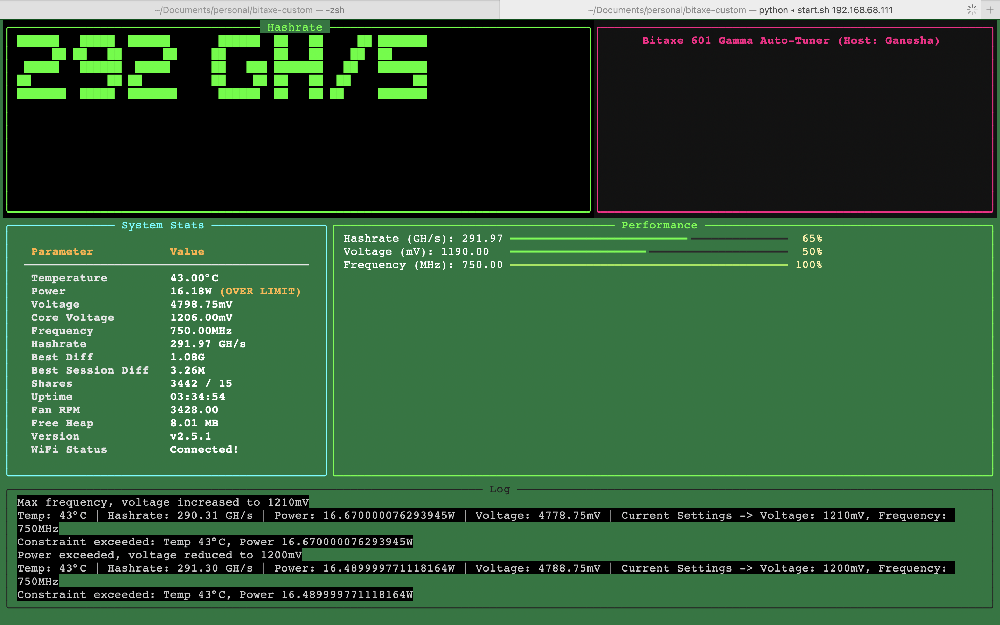

# Bitaxe 601 Gamma Auto-Tuner

## Overview

This Python script, `bitaxe.py`, is an auto-tuning utility designed for the Bitaxe 601 Gamma, a fully open-source Bitcoin ASIC miner based on the Bitaxe Ultra platform with the BM1366 ASIC. Its primary intent is to optimize the miner's performance by dynamically adjusting core voltage and frequency to achieve a target hashrate while managing heat and power consumption. The script leverages dual PID controllers for precise hashrate tuning, with an optional temperature-only mode, and includes a visually engaging TUI for real-time monitoring.



### Intent
- **Performance Optimization**: Tune voltage (1100–2400 mV) and frequency (400–750 MHz, in 25 MHz steps) to reach a user-defined hashrate setpoint using PID control.
- **Thermal Management**: Prioritize heat control by reducing frequency or voltage when temperature exceeds the target, leveraging the Microchip EMC2101’s proximity to the BM1366. In `--temp-watch` mode, this overrides PID to focus solely on temperature.
- **Stability**: Achieve a steady state by persisting settings across runs, resetting PID on stagnation, and avoiding over-aggressive adjustments.
- **User Experience**: Provide a cyberpunk-style TUI (Terminal User Interface) with ANSI-art hashrate display, system stats, and logs, plus detailed logging for debugging.

### Hardware Context
The Bitaxe 601 Gamma (assumed similar to Bitaxe Ultra 204):
- Uses the BM1366 ASIC, rated at 0.021 J/GH efficiency.
- Powered by 5V DC, 15W max, via a TI TPS40305 buck regulator and Maxim DS4432U+ DAC (0.04V–2.4V core voltage).
- Features an ESP32-S3-WROOM-1 for WiFi and API control, with an INA260 power meter and EMC2101 for fan/temp monitoring.
- Requires active cooling (e.g., 40x40mm fan).

## Features

- **PID Control**: Dual PID controllers adjust frequency (`Kp=0.1`, `Ki=0.01`, `Kd=0.05`) and voltage (`Kp=0.05`, `Ki=0.005`, `Kd=0.02`) to target hashrate, with `--temp-watch` mode switching to threshold-based temp control.
- **Safety Constraints**: Enforces BM1366 and Bitaxe limits (e.g., 15W power, 2400 mV max voltage, 400 MHz min frequency).
- **Snapshot Persistence**: Saves last settings to `bitaxe_snapshot.json` for continuity.
- **TUI Display**: Cyberpunk-themed live interface with an ANSI-art hashrate panel (integer GH/s), system stats (temp, power, voltage, etc.), progress bars, and scrolling log.
- **Logging**: Background logging to `bitaxe_monitor.log`, with CSV output (`bitaxe_tuning_log.csv`) for analysis, and optional console-only mode.

## Installation

1. **Prerequisites**:
   - Python 3.6+
   - Install dependencies:
     ```bash
     pip install requests simple-pid rich pyfiglet
     ```

## Usage

Run the script with the Bitaxe IP and optional arguments:
```bash
python bitaxe.py 192.168.68.111 --temp-watch -t 40 -s 400
```

- **Arguments**:
  - `bitaxe_ip`: IP address of the Bitaxe (required).
  - `-v/--voltage`: Initial core voltage in mV (default: 1200).
  - `-f/--frequency`: Initial frequency in MHz (default: 650).
  - `-t/--target_temp`: Target temperature in °C (default: 45).
  - `-i/--interval`: Monitoring interval in seconds (default: 7).
  - `-p/--power_limit`: Power limit in watts (default: 15).
  - `-s/--setpoint`: Target hashrate in GH/s (default: 450).
  - `--temp-watch`: Enable temperature-only mode; disables PID and only lowers frequency/voltage to control temp, ignoring hashrate.
  - `--log-to-console`: Disable TUI, log to console only.

## PID Controllers

The script uses dual PID (Proportional-Integral-Derivative) controllers as its core tuning mechanism:
- **Frequency PID**: Adjusts frequency in 25 MHz steps (`Kp=0.1`, `Ki=0.01`, `Kd=0.05`) to track the hashrate setpoint, balancing responsiveness and stability.
- **Voltage PID**: Fine-tunes voltage (`Kp=0.05`, `Ki=0.005`, `Kd=0.02`) to support frequency adjustments and avoid undervolting traps, with slower integration to prioritize stability.

### Behavior
- **Normal Mode**: PID controllers dynamically adjust frequency and voltage to reach the hashrate setpoint, with overrides for temperature (> `target_temp`) and power (> 15W) constraints. Stagnation detection resets PID if hashrate plateaus.
- **Temp-Watch Mode**: Disables PID control, switching to threshold-based logic that only lowers frequency or voltage to maintain temperature below the target, regardless of hashrate performance.
- **Tuning**: PID parameters are set conservatively to avoid oscillations given the discrete frequency steps and hardware response times, but can be adjusted in `DEFAULTS` for experimentation.

This implementation serves as an exercise in applying PID control to real-world hardware tuning, balancing theoretical precision with practical constraints.
```
```

### Key Changes in Script:
1. **Restored PID Controllers**:
   - Re-added `simple_pid` import and PID initialization for `pid_freq` and `pid_volt` with original parameters.
   - Restored PID logic in `monitor_and_adjust` under the `else` branch (normal mode), including `freq_output`, `volt_output`, stagnation detection, and drop handling.

2. **Integrated with `--temp-watch`**:
   - Kept the `if temp_watch:` block as threshold-based temp control only, bypassing PID.
   - Normal PID-based optimization runs only when `temp_watch` is `False`.

3. **Dependencies**:
   - Added `simple-pid` back to the runtime check in `__main__`.

### Key Changes in README:
1. **Updated Features**:
   - Emphasized PID control as the primary mechanism, with `--temp-watch` as an override.

2. **Revised PID Controllers Section**:
   - Removed the "disabled" narrative, now describing active PID use, tuning parameters, and behavior in both modes.
   - Highlighted the exercise aspect of PID application.

### How to Use:
- Save the script as `bitaxe.py`.
- Create `README.md` with:
  ```bash
  cat > README.md << 'EOF'
  [Paste the README content from the code block above here]
  EOF
  ```
- Install dependencies:
  ```bash
  pip install requests simple-pid rich pyfiglet
  ```
- Run with PID (normal mode):
  ```bash
  python bitaxe.py 192.168.68.111 -t 40 -s 400
  ```
- Run with `--temp-watch`:
  ```bash
  python bitaxe.py 192.168.68.111 --temp-watch -t 40 -s 400
  ```
  Credits: based on concepts and code in https://github.com/Hurllz/bitaxe-temp-monitor/ as I really needed a simple-pid based controller I had to refactor this extensively.
  
