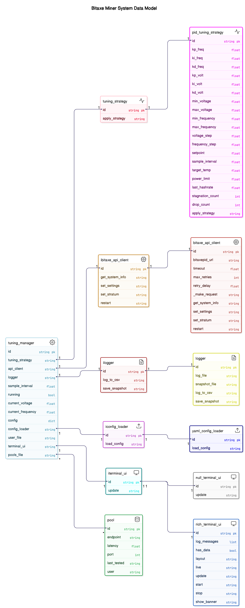

# BitaxePID Auto-Tuner


## Overview

`bitaxepid.py` is an auto-tuning utility for the Bitaxe 601 Gamma, an open-source Bitcoin ASIC miner built on the Bitaxe Ultra platform with the BM1366 ASIC. This script optimizes miner performance by dynamically adjusting core voltage and frequency to hit a target hashrate while managing temperature and power usage. It uses dual PID controllers (via `simple-pid`) for precise tuning, offers a temperature-only mode with `--temp-watch`, and provides a cyberpunk-themed TUI for real-time monitoring. Tuning data is logged to CSV and JSON files for analysis and persistence.

### Note
Upgrades may require updates to all files. You should either download the FULL release for a version, or clone the main repo.


---

### Intent
- **Performance Optimization**: Adjusts voltage (1100–2400 mV) and frequency (400–550 MHz, in 25 MHz steps) to meet a user-defined hashrate setpoint using PID control.
- **Thermal Management**: Ensures safe operation by reducing settings when temperature exceeds the target, using the EMC2101 sensor near the BM1366. In `--temp-watch` mode, this takes precedence over hashrate goals.
- **Stability**: Persists settings across runs with a snapshot file, resets PID on stagnation, and avoids unstable adjustments.
- **User Experience**: Features a rich TUI with ANSI-art hashrate display, system stats, progress bars, and logs, alongside detailed file-based logging.

### Hardware Context
The Bitaxe Supra Gamma (assumed similar to Bitaxe Ultra 204):
- BM1366 ASIC: 0.021 J/GH efficiency.
- Power: 5V DC, 15W max, via TI TPS40305 buck regulator and Maxim DS4432U+ DAC (0.04V–2.4V core voltage).
- Control: ESP32-S3-WROOM-1 for WiFi/API, with INA260 power meter and EMC2101 for fan/temp monitoring.
- Cooling: Requires a 40x40mm fan.

## Features

- **Model-Specific Configuration**: Load custom settings for different hardware models or tuning scenarios using a YAML configuration file via the `--config` switch.
- **PID Control**: Dual PID controllers tune frequency (`Kp=0.1`, `Ki=0.01`, `Kd=0.05`) and voltage (`Kp=0.05`, `Ki=0.005`, `Kd=0.02`) to achieve the hashrate setpoint, with `--temp-watch` overriding to focus on temperature.
- **Safety Constraints**: Respects hardware limits (15W power, 2400 mV max voltage, 400 MHz min frequency).
- **Snapshot Persistence**: Saves settings to `bitaxepid_snapshot.json` for continuity across runs.
- **TUI Display**: Cyberpunk-style interface with integer GH/s ANSI art, system stats (temp, power, voltage), progress bars, and a scrolling log.
- **Logging**: Outputs to `bitaxepid_monitor.log` and `bitaxepid_tuning_log.csv`, with an optional `--log-to-console` mode to disable the TUI.

## Installation

1. **Prerequisites**:
   - Python 3.6+
   - Install dependencies:
     ```bash
     pip install requests simple-pid rich pyfiglet pyyaml
     ```
     Or use:
     ```bash
     bash setup.sh  # Requires uv see https://docs.astral.sh/uv/getting-started/installation/
     ```
## Podman
```
podman build --tag bitaxepid-container .
podman run -it --publish 8093:8093 bitaxepid-container 192.168.68.111
```
## Usage

Run the script with the Bitaxe IP address and optional arguments:
```bash
python bitaxepid.py --ip 192.168.68.111 --config custom_config.yaml --voltage 1200 --frequency 500
or if you have the uv venv installation;
bash ./start.sh 192.168.68.111
or
% python bitaxepid.py --help
usage: bitaxepid.py [-h] [--version] --ip IP [--config CONFIG] [--user-file USER_FILE] [--pools-file POOLS_FILE]
                    [--primary-stratum PRIMARY_STRATUM] [--backup-stratum BACKUP_STRATUM] [--stratum-user STRATUM_USER]
                    [--fallback-stratum-user FALLBACK_STRATUM_USER] [--voltage VOLTAGE] [--frequency FREQUENCY]
                    [--sample-interval SAMPLE_INTERVAL] [--log-to-console] [--logging-level {info,debug}] [--serve-metrics]

BitaxePID Auto-Tuner

options:
  -h, --help            show this help message and exit
  --version             show program's version number and exit
  --ip IP               IP address of the Bitaxe miner
  --config CONFIG       Path to optional user YAML configuration file
  --user-file USER_FILE
                        Path to user YAML file (default: from config)
  --pools-file POOLS_FILE
                        Path to pools YAML file (default: from config)
  --primary-stratum PRIMARY_STRATUM
                        Primary stratum URL (e.g., stratum+tcp://host:port)
  --backup-stratum BACKUP_STRATUM
                        Backup stratum URL (e.g., stratum+tcp://host:port)
  --stratum-user STRATUM_USER
                        Stratum user for primary pool
  --fallback-stratum-user FALLBACK_STRATUM_USER
                        Stratum user for backup pool
  --voltage VOLTAGE     Initial voltage override (mV)
  --frequency FREQUENCY
                        Initial frequency override (MHz)
  --sample-interval SAMPLE_INTERVAL
                        Sample interval override (seconds)
  --log-to-console      Log to console instead of UI
  --logging-level {info,debug}
                        Logging level
  --serve-metrics       Serve metrics via HTTP on port 8093 (default: False)

### Configuration Notes
The script loads default settings from an ASIC model-specific YAML file (e.g., BM1366.yaml).
If --config is provided, it overrides the ASIC model defaults.
Options like --voltage, --frequency, and --sample-interval override corresponding values from the configuration files when specified.

### Example Configuration File (`BM1366.yaml`)
```yaml
# BM1366.yaml
INITIAL_FREQUENCY: 485       # "485 (default)" from BM1366DropdownFrequency
MIN_FREQUENCY: 400           # lowest available frequency in BM1366DropdownFrequency
MAX_FREQUENCY: 575           # highest available frequency in BM1366DropdownFrequency
INITIAL_VOLTAGE: 1200        # "1200 (default)" from BM1366CoreVoltage
MIN_VOLTAGE: 1100            # lowest available voltage in BM1366CoreVoltage
MAX_VOLTAGE: 1300            # highest available voltage in BM1366CoreVoltage
FREQUENCY_STEP: 25
VOLTAGE_STEP: 10
TARGET_TEMP: 55.0
SAMPLE_INTERVAL: 5
POWER_LIMIT: 15.0
HASHRATE_SETPOINT: 525
PID_FREQ_KP: 0.2
PID_FREQ_KI: 0.01
PID_FREQ_KD: 0.02
PID_VOLT_KP: 0.1
PID_VOLT_KI: 0.01
PID_VOLT_KD: 0.02
LOG_FILE: "bitaxepid_tuning_log_BM1366.csv"
SNAPSHOT_FILE: "bitaxepid_snapshot_BM1366.json"
POOLS_FILE: "pools.yaml"
METRICS_SERVE: FALSE
USER_FILE: "user.yaml" # only used if stratumuser is blank on Bitaxe. Force write with --stratum-user
# PRIMARY_STRATUM: "stratum+tcp://stratum.solomining.io:7777"
# BACKUP_STRATUM: "stratum+tcp://stratum.solomining.io:7777"
```

## What is a PID controller?

A PID controller is a widely used feedback system that continuously adjusts a process to reach a desired target by combining three key actions: the proportional term, which reacts to the current error between the setpoint and the measured value; the integral term, which accumulates past errors to eliminate steady-state discrepancies; and the derivative term, which predicts future errors based on the rate of change. This blend of immediate response, historical correction, and predictive adjustment allows the controller to improve system stability and performance across many applications—from motor speed and position control to temperature regulation—without relying on complex mathematical theory.

## What is `simple-pid`?

`simple-pid` is a Python library that implements a PID (Proportional-Integral-Derivative) controller, a feedback mechanism widely used to maintain a target value (here, hashrate). In this project:
- **How It Works**: The PID controller calculates an adjustment based on the error (difference between current hashrate and setpoint). It uses three terms:
  - **Proportional (P)**: Reacts to the current error (e.g., boosts frequency if hashrate is low).
  - **Integral (I)**: Accounts for past errors over time, correcting persistent deviations.
  - **Derivative (D)**: Predicts future error trends, dampening overshoots.
- **Role**: Two PID instances (`pid_freq` and `pid_volt`) adjust frequency and voltage, respectively, to stabilize hashrate while respecting hardware limits. The conservative tuning (`Kp`, `Ki`, `Kd`) ensures smooth changes despite discrete steps and hardware delays.

### Behavior
- **Normal Mode**: PID controllers optimize for hashrate, overridden by temperature (> `target_temp`) or power (> 15W * 1.075) constraints. Stagnation resets PID to avoid plateaus.
- **Temp-Watch Mode**: Bypasses PID, using simple threshold logic to lower frequency or voltage when temperature exceeds the target, ignoring hashrate.

## PID Controllers

- **Frequency PID**: Adjusts frequency in 25 MHz steps to track hashrate (`Kp=0.1`, `Ki=0.01`, `Kd=0.05`), balancing speed and stability.
- **Voltage PID**: Tunes voltage (`Kp=0.05`, `Ki=0.005`, `Kd=0.02`) to support frequency changes, prioritizing stability with slower integration.
- **Tuning**: Parameters are conservative to prevent oscillations; adjust in the YAML configuration file or via command-line arguments for testing.

This script demonstrates PID control applied to hardware tuning, blending precision with practical constraints.

## Clean Architecture

The script has been refactored to follow clean architecture principles, separating concerns into distinct layers:
- **Domain Layer**: Contains core business logic, such as PID tuning strategies and safety constraints.
- **Application Layer**: Coordinates the tuning process, managing interactions between domain logic, infrastructure, and presentation.
- **Infrastructure Layer**: Handles external interactions, including HTTP requests to the Bitaxe API, file I/O for logging and snapshots, and configuration loading.
- **Presentation Layer**: Manages the TUI for real-time monitoring.

This modular design improves maintainability, testability, and scalability, making it easier to extend the script for new features or hardware models.

## Diagram




## Credits

Based on concepts and code from [Hurllz/bitaxe-temp-monitor](https://github.com/Hurllz/bitaxe-temp-monitor/). 

Extensively refactored to integrate `simple-pid` for advanced control and to follow clean architecture principles.
```

### Key Updates
- **Installation**: Added `pyyaml` to the dependency list to support YAML configuration parsing.
- **Usage**: Updated the example to include the `--config` switch and clarified that command-line arguments override YAML settings.
- **Configuration**: Added a new section explaining the `--config` switch, including an example YAML file.
- **Features**: Highlighted the new model-specific configuration capability.
- **Clean Architecture**: Added a section describing the refactoring into Domain, Application, Infrastructure, and Presentation layers, emphasizing the benefits.
