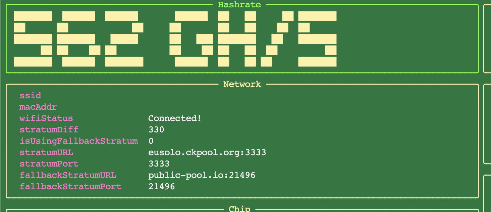

# BitaxePID Auto-Tuner


## Overview

`bitaxepid.py` is an auto-tuning utility for the Bitaxe 601 Gamma, an open-source Bitcoin ASIC miner built on the Bitaxe Ultra platform with the BM1366 ASIC. This script optimizes miner performance by dynamically adjusting core voltage and frequency to hit a target hashrate while managing temperature and power usage. It uses dual PID controllers (via `simple-pid`) for precise tuning, offers a temperature-only mode with `--temp-watch`, and provides a cyberpunk-themed TUI for real-time monitoring. Tuning data is logged to CSV and JSON files for analysis and persistence.



---

### Intent
- **Performance Optimization**: Adjusts voltage (1100–2400 mV) and frequency (400–550 MHz, in 25 MHz steps) to meet a user-defined hashrate setpoint using PID control.
- **Thermal Management**: Ensures safe operation by reducing settings when temperature exceeds the target, using the EMC2101 sensor near the BM1366. In `--temp-watch` mode, this takes precedence over hashrate goals.
- **Stability**: Persists settings across runs with a snapshot file, resets PID on stagnation, and avoids unstable adjustments.
- **User Experience**: Features a rich TUI with ANSI-art hashrate display, system stats, progress bars, and logs, alongside detailed file-based logging.

### Hardware Context
The Bitaxe Supra Gamma (assumed similar to Bitaxe Ultra 204):
- BM1366 ASIC: 0.021 J/GH efficiency.
- Power: 5V DC, 15W max, via TI TPS40305 buck regulator and Maxim DS4432U+ DAC (0.04V–2.4V core voltage).
- Control: ESP32-S3-WROOM-1 for WiFi/API, with INA260 power meter and EMC2101 for fan/temp monitoring.
- Cooling: Requires a 40x40mm fan.

## Features

- **Model-Specific Configuration**: Load custom settings for different hardware models or tuning scenarios using a YAML configuration file via the `--config` switch.
- **PID Control**: Dual PID controllers tune frequency (`Kp=0.1`, `Ki=0.01`, `Kd=0.05`) and voltage (`Kp=0.05`, `Ki=0.005`, `Kd=0.02`) to achieve the hashrate setpoint, with `--temp-watch` overriding to focus on temperature.
- **Safety Constraints**: Respects hardware limits (15W power, 2400 mV max voltage, 400 MHz min frequency).
- **Snapshot Persistence**: Saves settings to `bitaxepid_snapshot.json` for continuity across runs.
- **TUI Display**: Cyberpunk-style interface with integer GH/s ANSI art, system stats (temp, power, voltage), progress bars, and a scrolling log.
- **Logging**: Outputs to `bitaxepid_monitor.log` and `bitaxepid_tuning_log.csv`, with an optional `--log-to-console` mode to disable the TUI.

## Installation

1. **Prerequisites**:
   - Python 3.6+
   - Install dependencies:
     ```bash
     pip install requests simple-pid rich pyfiglet pyyaml
     ```
     Or use:
     ```bash
     bash setup.sh  # Requires uv
     ```

## Usage

Run the script with the Bitaxe IP address and optional arguments:
```bash
python bitaxepid.py --ip 192.168.68.111 --config custom_config.yaml --voltage 1200 --frequency 500

Arguments:
--ip IP: IP address of the Bitaxe miner (required).
--config CONFIG: Path to optional user YAML configuration file (no default).
--user-file USER_FILE: Path to user YAML file for stratum users (default: user.yaml).
--pools-file POOLS_FILE: Path to pools YAML file (default: pools.yaml).
--primary-stratum PRIMARY_STRATUM: Primary stratum URL (e.g., stratum+tcp://host:port) (no default).
--backup-stratum BACKUP_STRATUM: Backup stratum URL (e.g., stratum+tcp://host:port) (no default).
--stratum-user STRATUM_USER: Stratum user for primary pool (no default).
--fallback-stratum-user FALLBACK_STRATUM_USER: Stratum user for backup pool (no default).
--voltage VOLTAGE: Initial voltage override in mV (no default, overrides config if provided).
--frequency FREQUENCY: Initial frequency override in MHz (no default, overrides config if provided).
--sample-interval SAMPLE_INTERVAL: Monitoring interval override in seconds (no default, overrides config if provided).
--log-to-console: Log to console instead of UI (default: False).
--logging-level {info,debug}: Set logging level (default: info).
--version: Show the program’s version and exit.
Configuration Notes
The script loads default settings from an ASIC model-specific YAML file (e.g., BM1366.yaml).
If --config is provided, it overrides the ASIC model defaults.
Options like --voltage, --frequency, and --sample-interval override corresponding values from the configuration files when specified.

### Example Configuration File (`BM1366.yaml`)
```yaml
# BM1366.yaml
INITIAL_FREQUENCY: 485       # "485 (default)" from BM1366DropdownFrequency
MIN_FREQUENCY: 400           # lowest available frequency in BM1366DropdownFrequency
MAX_FREQUENCY: 575           # highest available frequency in BM1366DropdownFrequency
INITIAL_VOLTAGE: 1200        # "1200 (default)" from BM1366CoreVoltage
MIN_VOLTAGE: 1100            # lowest available voltage in BM1366CoreVoltage
MAX_VOLTAGE: 1300            # highest available voltage in BM1366CoreVoltage
FREQUENCY_STEP: 25
VOLTAGE_STEP: 10
TARGET_TEMP: 55.0
SAMPLE_INTERVAL: 5
POWER_LIMIT: 15.0
HASHRATE_SETPOINT: 500
PID_FREQ_KP: 0.2
PID_FREQ_KI: 0.01
PID_FREQ_KD: 0.02
PID_VOLT_KP: 0.1
PID_VOLT_KI: 0.01
PID_VOLT_KD: 0.02
LOG_FILE: "bitaxepid_tuning_log_BM1366.csv"
SNAPSHOT_FILE: "bitaxepid_snapshot_BM1366.json"
POOLS_FILE: "pools.yaml"     # Added this required setting
# Primary_Stratum: "stratum+tcp://solo.ckpool.org:3333"
# Backup_Stratum: "stratum+tcp://datafree.mine.ocean.xyz:3404"
```


## What is `simple-pid`?

`simple-pid` is a Python library that implements a PID (Proportional-Integral-Derivative) controller, a feedback mechanism widely used to maintain a target value (here, hashrate). In this project:
- **How It Works**: The PID controller calculates an adjustment based on the error (difference between current hashrate and setpoint). It uses three terms:
  - **Proportional (P)**: Reacts to the current error (e.g., boosts frequency if hashrate is low).
  - **Integral (I)**: Accounts for past errors over time, correcting persistent deviations.
  - **Derivative (D)**: Predicts future error trends, dampening overshoots.
- **Role**: Two PID instances (`pid_freq` and `pid_volt`) adjust frequency and voltage, respectively, to stabilize hashrate while respecting hardware limits. The conservative tuning (`Kp`, `Ki`, `Kd`) ensures smooth changes despite discrete steps and hardware delays.

### Behavior
- **Normal Mode**: PID controllers optimize for hashrate, overridden by temperature (> `target_temp`) or power (> 15W * 1.075) constraints. Stagnation resets PID to avoid plateaus.
- **Temp-Watch Mode**: Bypasses PID, using simple threshold logic to lower frequency or voltage when temperature exceeds the target, ignoring hashrate.

## PID Controllers

- **Frequency PID**: Adjusts frequency in 25 MHz steps to track hashrate (`Kp=0.1`, `Ki=0.01`, `Kd=0.05`), balancing speed and stability.
- **Voltage PID**: Tunes voltage (`Kp=0.05`, `Ki=0.005`, `Kd=0.02`) to support frequency changes, prioritizing stability with slower integration.
- **Tuning**: Parameters are conservative to prevent oscillations; adjust in the YAML configuration file or via command-line arguments for testing.

This script demonstrates PID control applied to hardware tuning, blending precision with practical constraints.

## Clean Architecture

The script has been refactored to follow clean architecture principles, separating concerns into distinct layers:
- **Domain Layer**: Contains core business logic, such as PID tuning strategies and safety constraints.
- **Application Layer**: Coordinates the tuning process, managing interactions between domain logic, infrastructure, and presentation.
- **Infrastructure Layer**: Handles external interactions, including HTTP requests to the Bitaxe API, file I/O for logging and snapshots, and configuration loading.
- **Presentation Layer**: Manages the TUI for real-time monitoring.

This modular design improves maintainability, testability, and scalability, making it easier to extend the script for new features or hardware models.

## Diagram


## Credits

Based on concepts and code from [Hurllz/bitaxe-temp-monitor](https://github.com/Hurllz/bitaxe-temp-monitor/). 

Extensively refactored to integrate `simple-pid` for advanced control and to follow clean architecture principles.
```

### Key Updates
- **Installation**: Added `pyyaml` to the dependency list to support YAML configuration parsing.
- **Usage**: Updated the example to include the `--config` switch and clarified that command-line arguments override YAML settings.
- **Configuration**: Added a new section explaining the `--config` switch, including an example YAML file.
- **Features**: Highlighted the new model-specific configuration capability.
- **Clean Architecture**: Added a section describing the refactoring into Domain, Application, Infrastructure, and Presentation layers, emphasizing the benefits.
