# BitaxePID Auto-Tuner


## Overview
The BitaxePID Auto-Tuner enhances the efficiency and reliability of Bitaxe miners by automating the adjustment of operational parameters—specifically voltage and frequency—based on real-time conditions. Its primary goal is to maintain an optimal operating temperature while keeping power consumption within safe limits, preventing overheating and ensuring stability. Here’s a breakdown of its core functionality:

1. **Dynamic Optimization:**
   - The system uses a `PIDTuningStrategy` to continuously monitor the miner’s temperature and power consumption. It adjusts frequency to keep the temperature near a target setpoint and voltage to ensure power stays below a predefined limit.
   - This adaptive tuning responds to environmental changes or hardware variations, ensuring consistent performance without manual intervention.

2. **Pool Management Efficiency:**
   - The `pools` module measures network latencies to mining pools using t-digest statistics, selecting the two fastest pools to minimize latency and improve mining efficiency. This reduces downtime and ensures the miner connects to the most responsive servers.

3. **Modularity and Flexibility:**
   - Interfaces like `IBitaxeAPIClient` and `TuningStrategy`, combined with dependency injection in `TuningManager`, make the system modular and extensible. Users can swap implementations (e.g., tuning strategies or UIs) without changing core logic.
   - Configuration is loaded from YAML files, with command-line overrides, enabling customization for different ASIC models or user preferences.

4. **Monitoring and Analysis:**
   - The `Logger` records detailed metrics (temperature, power, voltage, frequency, etc.) to a CSV file and tracks t-digest statistics for trend analysis. This data aids in performance optimization and troubleshooting.
   - An optional metrics server (port 8093) offers real-time monitoring, ideal for managing multiple miners or integrating with external systems.

5. **User Experience:**
   - The `RichTerminalUI` provides a dynamic, visually rich interface for real-time updates, while `NullTerminalUI` supports console-only logging, catering to varied user preferences.
   - Graceful shutdown handling ensures proper resource cleanup upon interruption.

**Overall Purpose:**  
The BitaxePID Auto-Tuner delivers a robust, automated solution that keeps Bitaxe miners running efficiently under diverse conditions. It balances thermal stability (via frequency adjustments), safety (via voltage control), and connectivity (via pool selection), while offering tools for monitoring and customization. This makes it ideal for miners aiming to maximize output without risking hardware damage or requiring constant oversight.

## Installation

1. **Prerequisites:**
   - Python 3.6+
   - Install dependencies:
     ```bash
     pip install requests simple-pid rich pyfiglet pyyaml
     ```
     Or use:
     ```bash
     bash setup.sh  # Requires uv
     ```

## Podman
```bash
podman build --tag bitaxepid-container .
podman run -it --publish 8093:8093 bitaxepid-container 192.168.68.111
```

## Usage

Run the script with the Bitaxe IP address and optional arguments:
```bash
python bitaxepid.py --ip 192.168.68.111 --config custom_config.yaml --voltage 1200 --frequency 500
```

For detailed options:
```bash
python bitaxepid.py --help
```
Output:
```
usage: bitaxepid.py [-h] [--version] --ip IP [--config CONFIG] [--user-file USER_FILE] [--pools-file POOLS_FILE]
                    [--primary-stratum PRIMARY_STRATUM] [--backup-stratum BACKUP_STRATUM] [--stratum-user STRATUM_USER]
                    [--fallback-stratum-user FALLBACK_STRATUM_USER] [--voltage VOLTAGE] [--frequency FREQUENCY]
                    [--sample-interval SAMPLE_INTERVAL] [--log-to-console] [--logging-level {info,debug}] [--serve-metrics]

BitaxePID Auto-Tuner

options:
  -h, --help            show this help message and exit
  --version             show program's version number and exit
  --ip IP               IP address of the Bitaxe miner
  --config CONFIG       Path to optional user YAML configuration file
  --user-file USER_FILE
                        Path to user YAML file
  --pools-file POOLS_FILE
                        Path to pools YAML file
  --primary-stratum PRIMARY_STRATUM
                        Primary stratum URL
  --backup-stratum BACKUP_STRATUM
                        Backup stratum URL
  --stratum-user STRATUM_USER
                        Stratum user for primary pool
  --fallback-stratum-user FALLBACK_STRATUM_USER
                        Stratum user for backup pool
  --voltage VOLTAGE     Initial voltage override (mV)
  --frequency FREQUENCY
                        Initial frequency override (MHz)
  --sample-interval SAMPLE_INTERVAL
                        Sample interval override (seconds)
  --log-to-console      Log to console instead of UI
  --logging-level {info,debug}
                        Logging level
  --serve-metrics       Serve metrics via HTTP on port 8093
```

### Configuration Notes
- The script loads default settings from an ASIC model-specific YAML file (e.g., `BM1366.yaml`).
- If `--config` is specified, it overrides the ASIC model defaults.
- Command-line options like `--voltage`, `--frequency`, and `--sample-interval` take precedence over values in configuration files when provided.

### Example Configuration File (`BM1366.yaml`)
```yaml
# BM1366.yaml
INITIAL_FREQUENCY: 485       # Default frequency (MHz)
MIN_FREQUENCY: 400           # Lowest available frequency (MHz)
MAX_FREQUENCY: 575           # Highest available frequency (MHz)
INITIAL_VOLTAGE: 1200        # Default voltage (mV)
MIN_VOLTAGE: 1100            # Lowest available voltage (mV)
MAX_VOLTAGE: 1300            # Highest available voltage (mV)
FREQUENCY_STEP: 25           # Frequency adjustment step (MHz)
VOLTAGE_STEP: 10             # Voltage adjustment step (mV)
TARGET_TEMP: 55.0            # Target temperature (°C)
SAMPLE_INTERVAL: 5           # Sampling interval (seconds)
POWER_LIMIT: 15.0            # Maximum power limit (W)
PID_FREQ_KP: 0.2             # Frequency PID proportional gain
PID_FREQ_KI: 0.01            # Frequency PID integral gain
PID_FREQ_KD: 0.02            # Frequency PID derivative gain
PID_VOLT_KP: 0.1             # Voltage PID proportional gain
PID_VOLT_KI: 0.01            # Voltage PID integral gain
PID_VOLT_KD: 0.02            # Voltage PID derivative gain
LOG_FILE: "bitaxepid_tuning_log_BM1366.csv"
SNAPSHOT_FILE: "bitaxepid_snapshot_BM1366.json"
POOLS_FILE: "pools.yaml"
METRICS_SERVE: FALSE
USER_FILE: "user.yaml"       # Used if stratum user is blank; force with --stratum-user
# PRIMARY_STRATUM: "stratum+tcp://stratum.solomining.io:7777"
# BACKUP_STRATUM: "stratum+tcp://stratum.solomining.io:7777"
```



## What is a PID Controller?
A PID (Proportional-Integral-Derivative) controller is a feedback mechanism that adjusts a process to maintain a desired target. It combines:
- **Proportional (P):** Responds to the current error (e.g., difference between actual and target temperature).
- **Integral (I):** Corrects accumulated past errors to eliminate persistent deviations.
- **Derivative (D):** Anticipates future errors based on the rate of change, reducing overshoot.

This combination ensures stable and efficient control, widely applied in systems like temperature regulation or motor speed adjustment, without requiring complex math.

## What is `simple-pid`?
`simple-pid` is a Python library implementing a PID controller. In this project:
- **How It Works:** It calculates adjustments based on the error between measured values (temperature or power) and their setpoints, using P, I, and D terms.
- **Role:** Two PID instances manage:
  - `pid_freq`: Adjusts frequency to stabilize temperature.
  - `pid_volt`: Tunes voltage to keep power within limits.
- **Tuning:** Conservative parameters (`Kp`, `Ki`, `Kd`) ensure smooth adjustments despite hardware constraints like discrete steps or delays. Adjust these in the YAML file or via command-line arguments.

### Behavior
- **Frequency PID:** Adjusts frequency in 25 MHz steps (`Kp=0.2`, `Ki=0.01`, `Kd=0.02`) to track the target temperature, balancing responsiveness and stability.
- **Voltage PID:** Tunes voltage in 10 mV steps (`Kp=0.1`, `Ki=0.01`, `Kd=0.02`) to enforce the power limit, prioritizing gradual changes.

This demonstrates practical PID control tailored to hardware tuning.

## Clean Architecture
The script follows clean architecture principles, separating concerns into layers:
- **Domain Layer:** Core logic, including PID tuning and safety constraints.
- **Application Layer:** Coordinates tuning, bridging domain logic with infrastructure and presentation.
- **Infrastructure Layer:** Manages external interactions (e.g., Bitaxe API calls, file I/O, configuration loading).
- **Presentation Layer:** Handles the terminal UI for real-time monitoring.

This design enhances maintainability, testability, and scalability, simplifying future extensions or hardware support.

## Diagrams
- Application Flow:  
  
- Entities:  
  

## Credits
Based on concepts and code from [Hurllz/bitaxe-temp-monitor](https://github.com/Hurllz/bitaxe-temp-monitor/). Extensively refactored to integrate `simple-pid` and adhere to clean architecture principles.

---

### Key Changes
- **Removed Deprecated Features:** Eliminated all references to hashrate optimization, `hashrate_setpoint`, and "Temp-Watch Mode," focusing solely on temperature and power management.
- **Added Clarity:** Enhanced explanations of PID controllers, configuration overrides, and the project’s purpose, making it accessible to new users.
- **Improved Structure:** Used markdown consistently for readability, with code blocks, lists, and headings to organize content effectively.
- **Updated Usage:** Included a full `--help` output and detailed configuration notes to guide users.

This updated `README.md` is now concise, user-friendly, and aligned with the project’s current functionality, providing a solid foundation for both users and developers.
