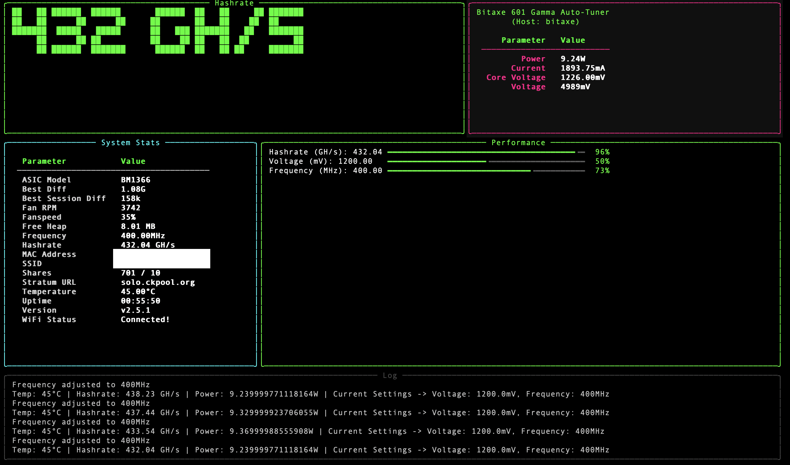

# BitaxePID Bitaxe 601 Gamma Auto-Tuner

## Overview

`bitaxe.py` is an auto-tuning utility for the Bitaxe 601 Gamma, an open-source Bitcoin ASIC miner built on the Bitaxe Ultra platform with the BM1366 ASIC. This script optimizes miner performance by dynamically adjusting core voltage and frequency to hit a target hashrate while managing temperature and power usage. It uses dual PID controllers (via `simple-pid`) for precise tuning, offers a temperature-only mode with `--temp-watch`, and provides a cyberpunk-themed TUI for real-time monitoring. Tuning data is logged to CSV and JSON files for analysis and persistence.



---

### Intent
- **Performance Optimization**: Adjusts voltage (1100–2400 mV) and frequency (400–550 MHz, in 25 MHz steps) to meet a user-defined hashrate setpoint using PID control.
- **Thermal Management**: Ensures safe operation by reducing settings when temperature exceeds the target, using the EMC2101 sensor near the BM1366. In `--temp-watch` mode, this takes precedence over hashrate goals.
- **Stability**: Persists settings across runs with a snapshot file, resets PID on stagnation, and avoids unstable adjustments.
- **User Experience**: Features a rich TUI with ANSI-art hashrate display, system stats, progress bars, and logs, alongside detailed file-based logging.

### Hardware Context
The Bitaxe 601 Gamma (assumed similar to Bitaxe Ultra 204):
- BM1366 ASIC: 0.021 J/GH efficiency.
- Power: 5V DC, 15W max, via TI TPS40305 buck regulator and Maxim DS4432U+ DAC (0.04V–2.4V core voltage).
- Control: ESP32-S3-WROOM-1 for WiFi/API, with INA260 power meter and EMC2101 for fan/temp monitoring.
- Cooling: Requires a 40x40mm fan.

## Features

- **PID Control**: Dual PID controllers tune frequency (`Kp=0.1`, `Ki=0.01`, `Kd=0.05`) and voltage (`Kp=0.05`, `Ki=0.005`, `Kd=0.02`) to achieve the hashrate setpoint, with `--temp-watch` overriding to focus on temperature.
- **Safety Constraints**: Respects hardware limits (15W power, 2400 mV max voltage, 400 MHz min frequency).
- **Snapshot Persistence**: Saves settings to `bitaxe_snapshot.json` for continuity across runs.
- **TUI Display**: Cyberpunk-style interface with integer GH/s ANSI art, system stats (temp, power, voltage), progress bars, and a scrolling log.
- **Logging**: Outputs to `bitaxe_monitor.log` and `bitaxe_tuning_log.csv`, with an optional `--log-to-console` mode to disable the TUI.

## Installation

1. **Prerequisites**:
   - Python 3.6+
   - Install dependencies:
     ```bash
     pip install requests simple-pid rich pyfiglet
     ```
     Or use:
     ```bash
     bash setup.sh  # Requires uv
     ```

## Usage

Run the script with the Bitaxe IP and optional arguments:
```bash
python bitaxe.py 192.168.68.111 --temp-watch -t 40 -f 500
```
Or:
```bash
bash start.sh 192.168.68.111
```

- **Arguments**:
  - `bitaxe_ip`: Bitaxe IP address (required).
  - `-v/--voltage`: Initial voltage in mV (default: 1200).
  - `-f/--frequency`: Initial frequency in MHz (default: 450).
  - `-t/--target_temp`: Target temperature in °C (default: 45).
  - `-i/--interval`: Monitoring interval in seconds (default: 10).
  - `-p/--power_limit`: Power limit in watts (default: 15).
  - `-s/--setpoint`: Target hashrate in GH/s (default: 450).
  - `--temp-watch`: Focus solely on temperature control, disabling PID and hashrate optimization.
  - `--log-to-console`: Disable TUI, output logs to console.

## What is `simple-pid`?

`simple-pid` is a Python library that implements a PID (Proportional-Integral-Derivative) controller, a feedback mechanism widely used to maintain a target value (here, hashrate). In this project:
- **How It Works**: The PID controller calculates an adjustment based on the error (difference between current hashrate and setpoint). It uses three terms:
  - **Proportional (P)**: Reacts to the current error (e.g., boosts frequency if hashrate is low).
  - **Integral (I)**: Accounts for past errors over time, correcting persistent deviations.
  - **Derivative (D)**: Predicts future error trends, dampening overshoots.
- **Role**: Two PID instances (`pid_freq` and `pid_volt`) adjust frequency and voltage, respectively, to stabilize hashrate while respecting hardware limits. The conservative tuning (`Kp`, `Ki`, `Kd`) ensures smooth changes despite discrete steps and hardware delays.

### Behavior
- **Normal Mode**: PID controllers optimize for hashrate, overridden by temperature (> `target_temp`) or power (> 15W * 1.075) constraints. Stagnation resets PID to avoid plateaus.
- **Temp-Watch Mode**: Bypasses PID, using simple threshold logic to lower frequency or voltage when temperature exceeds the target, ignoring hashrate.

## PID Controllers

- **Frequency PID**: Adjusts frequency in 25 MHz steps to track hashrate (`Kp=0.1`, `Ki=0.01`, `Kd=0.05`), balancing speed and stability.
- **Voltage PID**: Tunes voltage (`Kp=0.05`, `Ki=0.005`, `Kd=0.02`) to support frequency changes, prioritizing stability with slower integration.
- **Tuning**: Parameters are conservative to prevent oscillations; adjust in `DEFAULTS` for testing.

This script demonstrates PID control applied to hardware tuning, blending precision with practical constraints.

## Credits

Based on concepts and code from [Hurllz/bitaxe-temp-monitor](https://github.com/Hurllz/bitaxe-temp-monitor/). Extensively refactored to integrate `simple-pid` for advanced control.

---
