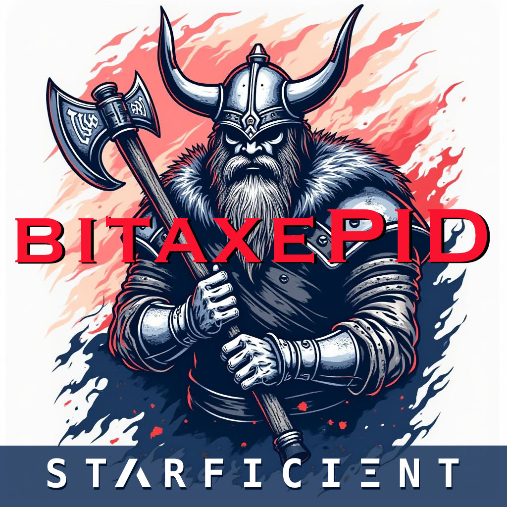
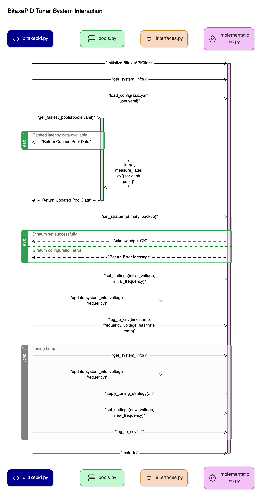

# BitaxePID Auto-Tuner


## Overview
The BitaxePID Auto-Tuner is designed to enhance the efficiency and reliability of Bitaxe miners by automating the adjustment of operational parameters—specifically voltage and frequency—based on real-time conditions. Its primary intent is to maintain an optimal operating temperature (via a PID control loop) while maximizing mining performance, preventing overheating, and ensuring stability. Here’s a breakdown of the purpose behind its logic:

1. **Dynamic Optimization:**
   - The system uses a `PIDTuningStrategy` to continuously monitor the miner’s temperature and adjust frequency to keep it near a target setpoint. If temperature exceeds safe thresholds despite frequency adjustments, voltage is reduced, balancing performance and thermal safety.
   - This dynamic tuning contrasts with static settings, adapting to environmental changes or hardware variations.

2. **Pool Management Efficiency:**
   - The `pools` module measures network latencies to mining pools using t-digest statistics, selecting the two fastest pools to minimize latency and improve mining efficiency. This ensures the miner connects to the most responsive servers, reducing downtime or inefficiencies due to network delays.

3. **Modularity and Flexibility:**
   - By defining interfaces (`IBitaxeAPIClient`, `TuningStrategy`, etc.) and using dependency injection in `TuningManager`, the system is modular and extensible. Users can swap implementations (e.g., different tuning strategies or UIs) without altering core logic.
   - Configuration is loaded from YAML files, with command-line overrides, allowing customization for different ASIC models or user preferences.

4. **Monitoring and Analysis:**
   - The `Logger` records detailed metrics (hashrate, temperature, power, etc.) to a CSV file and maintains t-digest statistics for trend analysis at various temperatures. This data supports performance optimization and troubleshooting.
   - An optional metrics server (port 8093) provides real-time monitoring, useful for managing multiple miners or integrating with external systems.

5. **User Experience:**
   - The `RichTerminalUI` offers a dynamic, visually rich interface for real-time status updates, while `NullTerminalUI` supports console-only logging, catering to different user needs.
   - Graceful shutdown handling ensures resources are cleaned up properly upon interruption.

**Overall Purpose:**
The logic is structured to create a robust, automated solution that keeps Bitaxe miners running efficiently under varying conditions. It balances performance (via frequency adjustments), safety (via voltage control), and connectivity (via pool selection), while providing tools for monitoring and customization. This makes it valuable for miners seeking to maximize output without manual intervention or risking hardware damage.

## Installation

1. **Prerequisites**:
   - Python 3.6+
   - Install dependencies:
     ```bash
     pip install requests simple-pid rich pyfiglet pyyaml
     ```
     Or use:
     ```bash
     bash setup.sh  # Requires uv
     ```
## Podman
```
podman build --tag bitaxepid-container .
podman run -it --publish 8093:8093 bitaxepid-container 192.168.68.111
```
## Usage

Run the script with the Bitaxe IP address and optional arguments:
```bash
python bitaxepid.py --ip 192.168.68.111 --config custom_config.yaml --voltage 1200 --frequency 500
or
% python bitaxepid.py --help
usage: bitaxepid.py [-h] [--version] --ip IP [--config CONFIG] [--user-file USER_FILE] [--pools-file POOLS_FILE]
                    [--primary-stratum PRIMARY_STRATUM] [--backup-stratum BACKUP_STRATUM] [--stratum-user STRATUM_USER]
                    [--fallback-stratum-user FALLBACK_STRATUM_USER] [--voltage VOLTAGE] [--frequency FREQUENCY]
                    [--sample-interval SAMPLE_INTERVAL] [--log-to-console] [--logging-level {info,debug}] [--serve-metrics]

BitaxePID Auto-Tuner

options:
  -h, --help            show this help message and exit
  --version             show program's version number and exit
  --ip IP               IP address of the Bitaxe miner
  --config CONFIG       Path to optional user YAML configuration file
  --user-file USER_FILE
                        Path to user YAML file (default: from config)
  --pools-file POOLS_FILE
                        Path to pools YAML file (default: from config)
  --primary-stratum PRIMARY_STRATUM
                        Primary stratum URL (e.g., stratum+tcp://host:port)
  --backup-stratum BACKUP_STRATUM
                        Backup stratum URL (e.g., stratum+tcp://host:port)
  --stratum-user STRATUM_USER
                        Stratum user for primary pool
  --fallback-stratum-user FALLBACK_STRATUM_USER
                        Stratum user for backup pool
  --voltage VOLTAGE     Initial voltage override (mV)
  --frequency FREQUENCY
                        Initial frequency override (MHz)
  --sample-interval SAMPLE_INTERVAL
                        Sample interval override (seconds)
  --log-to-console      Log to console instead of UI
  --logging-level {info,debug}
                        Logging level
  --serve-metrics       Serve metrics via HTTP on port 8093 (default: False)

### Configuration Notes
The script loads default settings from an ASIC model-specific YAML file (e.g., BM1366.yaml).
If --config is provided, it overrides the ASIC model defaults.
Options like --voltage, --frequency, and --sample-interval override corresponding values from the configuration files when specified.

### Example Configuration File (`BM1366.yaml`)
```yaml
# BM1366.yaml
INITIAL_FREQUENCY: 485       # "485 (default)" from BM1366DropdownFrequency
MIN_FREQUENCY: 400           # lowest available frequency in BM1366DropdownFrequency
MAX_FREQUENCY: 575           # highest available frequency in BM1366DropdownFrequency
INITIAL_VOLTAGE: 1200        # "1200 (default)" from BM1366CoreVoltage
MIN_VOLTAGE: 1100            # lowest available voltage in BM1366CoreVoltage
MAX_VOLTAGE: 1300            # highest available voltage in BM1366CoreVoltage
FREQUENCY_STEP: 25
VOLTAGE_STEP: 10
TARGET_TEMP: 55.0
SAMPLE_INTERVAL: 5
POWER_LIMIT: 15.0
HASHRATE_SETPOINT: 525
PID_FREQ_KP: 0.2
PID_FREQ_KI: 0.01
PID_FREQ_KD: 0.02
PID_VOLT_KP: 0.1
PID_VOLT_KI: 0.01
PID_VOLT_KD: 0.02
LOG_FILE: "bitaxepid_tuning_log_BM1366.csv"
SNAPSHOT_FILE: "bitaxepid_snapshot_BM1366.json"
POOLS_FILE: "pools.yaml"
METRICS_SERVE: FALSE
USER_FILE: "user.yaml" # only used if stratumuser is blank on Bitaxe. Force write with --stratum-user
# PRIMARY_STRATUM: "stratum+tcp://stratum.solomining.io:7777"
# BACKUP_STRATUM: "stratum+tcp://stratum.solomining.io:7777"
```

## What is a PID controller?

A PID controller is a widely used feedback system that continuously adjusts a process to reach a desired target by combining three key actions: the proportional term, which reacts to the current error between the setpoint and the measured value; the integral term, which accumulates past errors to eliminate steady-state discrepancies; and the derivative term, which predicts future errors based on the rate of change. This blend of immediate response, historical correction, and predictive adjustment allows the controller to improve system stability and performance across many applications—from motor speed and position control to temperature regulation—without relying on complex mathematical theory.

## What is `simple-pid`?

`simple-pid` is a Python library that implements a PID (Proportional-Integral-Derivative) controller, a feedback mechanism widely used to maintain a target value (here, hashrate). In this project:
- **How It Works**: The PID controller calculates an adjustment based on the error (difference between current hashrate and setpoint). It uses three terms:
  - **Proportional (P)**: Reacts to the current error (e.g., boosts frequency if hashrate is low).
  - **Integral (I)**: Accounts for past errors over time, correcting persistent deviations.
  - **Derivative (D)**: Predicts future error trends, dampening overshoots.
- **Role**: Two PID instances (`pid_freq` and `pid_volt`) adjust frequency and voltage, respectively, to stabilize hashrate while respecting hardware limits. The conservative tuning (`Kp`, `Ki`, `Kd`) ensures smooth changes despite discrete steps and hardware delays.

### Behavior
- **Normal Mode**: PID controllers optimize for hashrate, overridden by temperature (> `target_temp`) or power (> 15W * 1.075) constraints. Stagnation resets PID to avoid plateaus.
- **Temp-Watch Mode**: Bypasses PID, using simple threshold logic to lower frequency or voltage when temperature exceeds the target, ignoring hashrate.

## PID Controllers

- **Frequency PID**: Adjusts frequency in 25 MHz steps to track hashrate (`Kp=0.1`, `Ki=0.01`, `Kd=0.05`), balancing speed and stability.
- **Voltage PID**: Tunes voltage (`Kp=0.05`, `Ki=0.005`, `Kd=0.02`) to support frequency changes, prioritizing stability with slower integration.
- **Tuning**: Parameters are conservative to prevent oscillations; adjust in the YAML configuration file or via command-line arguments for testing.

This script demonstrates PID control applied to hardware tuning, blending precision with practical constraints.

## Clean Architecture

The script has been refactored to follow clean architecture principles, separating concerns into distinct layers:
- **Domain Layer**: Contains core business logic, such as PID tuning strategies and safety constraints.
- **Application Layer**: Coordinates the tuning process, managing interactions between domain logic, infrastructure, and presentation.
- **Infrastructure Layer**: Handles external interactions, including HTTP requests to the Bitaxe API, file I/O for logging and snapshots, and configuration loading.
- **Presentation Layer**: Manages the TUI for real-time monitoring.

This modular design improves maintainability, testability, and scalability, making it easier to extend the script for new features or hardware models.

## Diagram




## Credits

Based on concepts and code from [Hurllz/bitaxe-temp-monitor](https://github.com/Hurllz/bitaxe-temp-monitor/). 

Extensively refactored to integrate `simple-pid` for advanced control and to follow clean architecture principles.
```

### Key Updates
- **Installation**: Added `pyyaml` to the dependency list to support YAML configuration parsing.
- **Usage**: Updated the example to include the `--config` switch and clarified that command-line arguments override YAML settings.
- **Configuration**: Added a new section explaining the `--config` switch, including an example YAML file.
- **Features**: Highlighted the new model-specific configuration capability.
- **Clean Architecture**: Added a section describing the refactoring into Domain, Application, Infrastructure, and Presentation layers, emphasizing the benefits.
